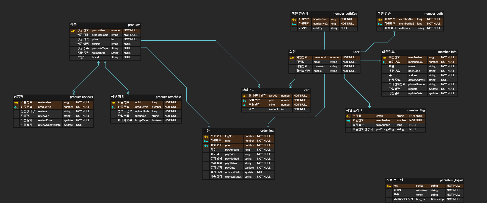

# 신준혁

## 프로필
	
* 이름 : 신준혁
	
* 나이 : 30
	
* 학력 : 한신대학교 졸업
	
* 전공 : 국어국문학과/일어일문과
	
* 병역 : 육군 병장 만료 전역

## 발자취
  
[Github](https://github.com/sjh910203)

email : sjh910203@gmail.com

## 프로젝트 경력
  
* 2016/6 ~ 2016/8 Verb(국비지원 학원 프로젝트)
  
* 2019/4/16 ~ 2019/11/26 Petshop 온라인 쇼핑몰(포트폴리오용 개인 프로젝트)
  
## 학 력
  	
* 2010년 용인고등학교 졸업
	
* 2016년 2월 한신대학교 졸업(전공 : 국어국문학과 부전공 : 일어일문학과)
  
## 언어 관련 경험

* 국비지원 JAVA & DB 프로그래밍과정 이수

* 기간 : 2016.03.07 ~ 2016.08.25 

* 교육기관 : 비트교육센터 별관
	
* [교육 내용](./file/이수교육내역서.docx)
	
	
# 주요 프로젝트

# *Verb*

### * 프로젝트 명 : 동사(Verb)

### * 개 발 기 간 : 1~2개월

### * 투 입 인 원 : 3명

### * 프로젝트 소개 : 지도의 위치서비스를 기반으로 유기동물의 정보를 저장하여서 해당 위치의 유기동물 정보를 검색 가능하게 하는 서비스

### * 개발목표 

	1. 지도 API와 DBMS를 이용하여 위치정보 저장 및 검색
	
	2. DBMS를 이용한 회원정보 관리
	
### * 본인역할 :  팀원. 전체적인 부분 통괄 및 백엔드 담당
	
	1. 자바를 이용하여 스프링 MVC모델을 구축
	
	2. Mysql과 자바를 JDBC(Java Database Connectivity) API를 통해 연결, 사용되는 Query문 구축
	
### * 개발환경 및 사용기술

	1. 사용(개발) 언어 : JAVA

	2. 사용 O/S : Window7

	3. 사용 D/B : Mysql

	4. 사용(개발)  툴 : ECLIPSE, Mysql Workbench, Brackets

	5. 웹 표준 기술 : HTML, CSS, JavaScript, jQuery

	6. 프레임워크 : Spring, MyBatis

### * 주요특징 

	SPRING MVC 모델의 구조를 가지고 있는 다이나믹 웹 프로젝트.

### * 주요기능

	다음 지도API를 사용하여, 원하는 위치에 분실, 구조 또는 목격 정보를 업로드 업로드 한 정보들은 DBMS와 자바를 연결하는 API인 JDBC를 사용하여 DB로 저장을 하고, 등록한 사용자 외의 다른 사용자들에게도 보여줄 수 있게 함
		
### * 구현한 기능 

	회원 정보 CRUD, 게시물 CRUD, 게시판 페이징 기능, 이미지 업로드 기능, 우편번호 검색 API, 다음 지도 API, SimpleEmailSender API

### * 문제해결사례
	1. 기술부문 :
		* AJAX - 아이디 중복 검사 기능에 쓰인 기능으로, 자바스크립트, jQuery 부분을 간단하게 배워서 곤란했었지만, 인터넷 검색을 통해 해결. 우선 json 라이브러리의 추가 후, json 객체에 쿼리문의 where절에 입력한 아이디를 입력하여, 리스트의 사이즈를 뽑아서 보내줌. 이후 html 부분에서, jQuery를 통해 결과값을 읽어 들이고, 중복 여부를 표시함
				
		* 페이징 - 페이징 기능은 인터넷에 예제로 많이 떠돌긴 하지만, 그 당시 대부분이 정부 표준 프레임워크를 사용하는 방식이었음. 저는 정부 표준 프레임워크 이외의 방식을 사용하고 싶었기 때문에, 인터넷의 예제들을 참고하여 스스로 만들어보았었는데, 그 방식은 쿼리문에 limit를 이용하여, 한 페이지 분의 데이터를 뽑아오고, 그 때 웹페이지에서 몇 페이지인지를 받아와서, 그 입력값을 통해 몇 번째의 리스트를 뽑아오는지 결정해서, 리스트를 웹페이지에 보냈음
		
	2. 비 기술부문 :
		* 인원부족 - 프로젝트를 시작하고 얼마 안 가서 팀장과 부팀장이 취업으로 팀프로젝트에서 빠져나가는 사태가 발생. 그 당시 총 5명이었던 팀원 중 전공자는 팀장과 부팀장 뿐이었고, 나머지는 학원에 와서 배우기 시작하였던 이들이었음. 이로 인해 원래 기획하였던 프로젝트에서 기능들의 대다수가 빠지게 되었지만, 남은 인원들을 모아서 축소 된 프로젝트를 진행하게 되었고, 결국 완성하게 됨
				
## Petshop

링크 : [Petshop](http://www.petshopsjh910203.site)

리포지터리 : [Git](https://github.com/sjh910203/portfolio-v2)

### * 프로젝트 명 : Petshop

### * 개 발 기 간 : 4/16 ~ 11/26

### * 투 입 인 원 : 1명

### * 프로젝트 소개 : 스프링 프레임워크를 이용한 mvc 모델 온라인 쇼핑몰을 구축
	
### * 개발목표

	* 스프링 프레임워크를 이용하여 실제 서비스 되고 있는 것과 비슷한 온라인 쇼핑몰 구축
	
	* 가상머신을 통해서 실제 서비스 되는 것과 같이 서버 구축
	
### * 개발환경 및 사용기술

	* 사용(개발) 언어 : JAVA

	* 사용 O/S : Window10 , Centos7

	* 사용 D/B : Oracle 11g xe

	* 사용(개발)  툴 : ECLIPSE, SQLDeveloper, sqlplus, Brackets

	* 웹 표준 기술 : HTML, CSS, JavaScript, jQuery

	* 프레임워크 : Spring Framework

	* 참고 서적 : 뇌를 자극하는 Java 프로그래밍, 코드로 배우는 스프링 웹 프로젝트

### * 주요기능(구동원리) 및 특징
	* 상품 정보 CRUD
	
	* ajax를 이용한 화면 전환 없는 상품평 관리 기능

	* Oracle11g를 이용한 데이터 관리 기능

	* 스프링 시큐리티를 이용한 회원 관리 기능 

	* Google SMTP를 이용한 회원가입 인증 

	* OAuth 2.0을 이용한 소셜 로그인 

	* Google Cloud Platform의 가상머신을 이용한 실제 서버 가동
	
### * ERD
		

### * 프로젝트 중 발생한 문제점

	* 멘토의 부재
	
	* QA인원의 부재로 인해 버그 발견이 힘들어서 자연히 exception 처리도 허술하게 되었음
	
	* 코드 작성 경험 부족으로 코드 최적화가 안되는 문제 -> 불필요한 코드가 많아져서 모듈화로 중복으로 쓰이는 코드 최소화 필요
	
### * 기술 외적인 문제점
	
	* Github 커밋시 자잘한 단위를 무시하고 한꺼번에 커밋 -> Github 커밋 단위를 파일 단위로 사용하기
		
	* 프로젝트 경험 부족으로 일정 관리가 엉망 -> 지속적인 프로젝트 일정 기록으로 일정 관리
